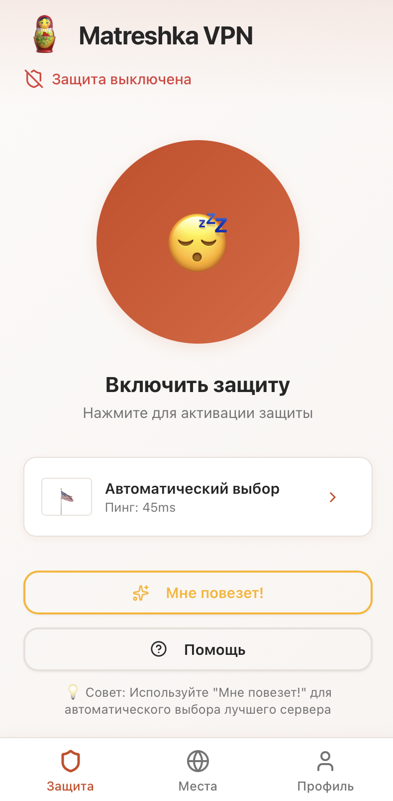
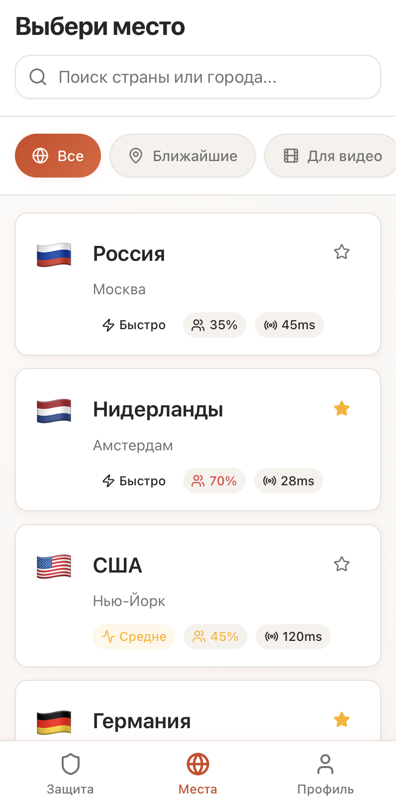
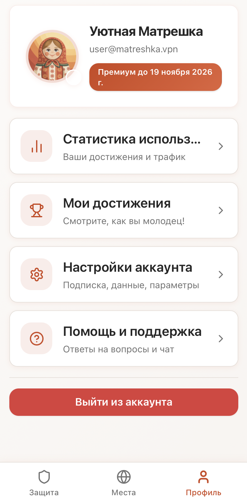
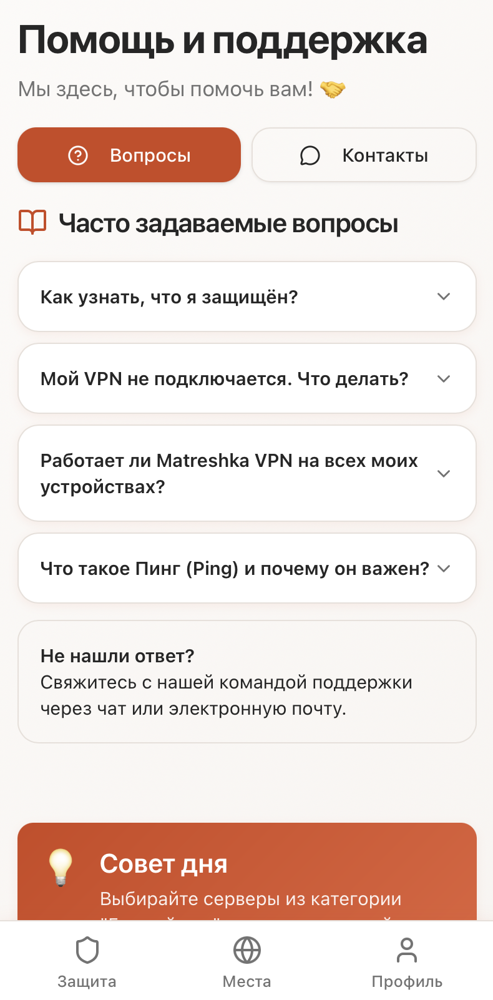
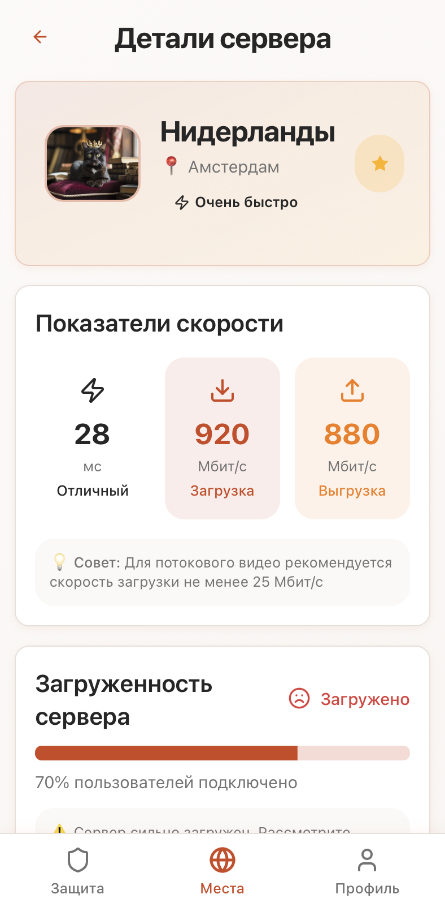
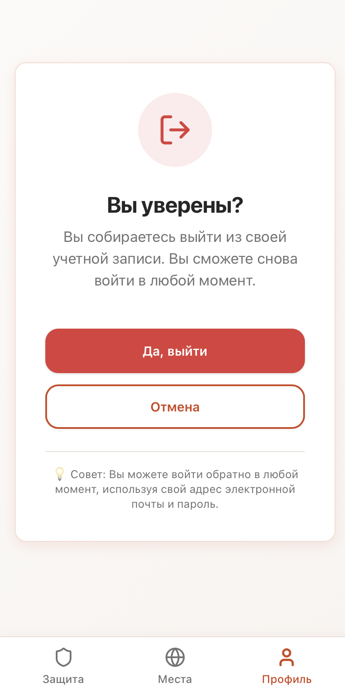
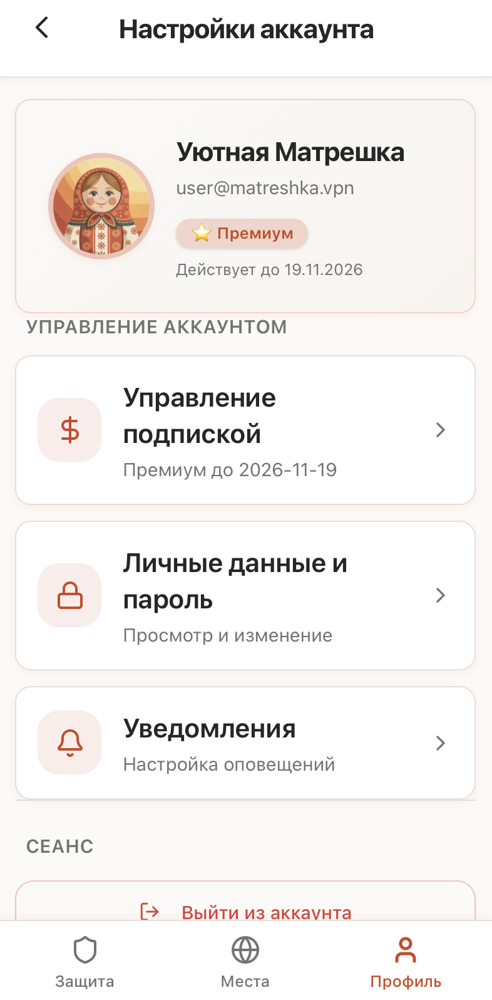

# Matreshka VPN

<div align="center">

{width=50 height=50}


https://www.youtube.com/shorts/DU3mklTjS2c [demo video]

**A secure, multi-protocol VPN client application built with Flutter**

[](https://flutter.dev/) [](https://dart.dev/) [](https://opensource.org/licenses/MIT)

</div>

## 📖 Table of Contents

- [Matreshka VPN](#matreshka-vpn)
  - [📖 Table of Contents](#-table-of-contents)
  - [🎯 Overview](#-overview)
  - [✨ Features](#-features)
  - [🌐 Supported Protocols](#-supported-protocols)
  - [🚀 Installation](#-installation)
  - [💻 Usage](#-usage)
  - [📸 Screenshots](#-screenshots)
  - [🏗️ Architecture](#️-architecture)
  - [🤝 Contributing](#-contributing)
  - [📄 License](#-license)

## 🎯 Overview

Matreshka VPN is a comprehensive VPN client application designed to provide secure and private internet access through multiple VPN protocols. The app offers a user-friendly interface with advanced security features, allowing users to protect their online privacy and bypass geo-restrictions.

Named after the iconic Russian Matryoshka dolls, the app represents layers of protection wrapping your digital identity. With support for multiple VPN protocols, users can choose the best option for their needs in terms of security, speed, and reliability.

## ✨ Features

- **Multi-Protocol Support**: Connect using OpenVPN, WireGuard, or VLESS protocols
- **Real-time Status Monitoring**: Track connection status and IP information
- **Automatic Server Selection**: "Try Your Luck" feature for optimal server selection
- **Geographic Server Locations**: Multiple server locations worldwide
- **Speed Testing**: Monitor connection speeds and server performance
- **Dark/Light Themes**: Adaptive theming based on system preferences
- **Intuitive UI**: Clean, user-friendly interface with easy navigation
- **Secure Connection Management**: One-tap connect/disconnect functionality
- **IP Address Protection**: Hide your real IP and appear from different locations
- **Performance Optimization**: Efficient resource usage and battery conservation

## 🌐 Supported Protocols

Matreshka VPN supports three industry-standard VPN protocols:

- **OpenVPN**: Robust and secure protocol with strong encryption
- **WireGuard**: Modern, fast, and lightweight protocol
- **VLESS**: Advanced protocol optimized for performance and security

Each protocol offers unique advantages in terms of speed, security, and compatibility with various networks.

## 🚀 Installation

1. Make sure you have Flutter SDK installed on your system
2. Clone the repository:
   ```bash
   git clone https://github.com/yourusername/matreshka_vpn.git
   cd matreshka_vpn
   ```
3. Install dependencies:
   ```bash
   flutter pub get
   ```
4. Build the application:
   ```bash
   flutter build apk  # For Android
   flutter build ios   # For iOS
   ```

> **Note**: Platform-specific VPN permissions and configurations may be required for the application to function properly on mobile devices.

## 💻 Usage

1. Launch the application
2. Navigate to the Defense tab
3. Select your preferred VPN protocol (OpenVPN, WireGuard, or VLESS)
4. Tap the connect button to establish a VPN connection
5. Monitor your connection status and IP information
6. Use the "Try Your Luck" feature for automatic server selection
7. Access geo-restricted content securely

The app provides real-time information about your connection status, IP address, and server location.

## 📸 Screenshots

<div align="center">




<br>



<br>




</div>

## 🏗️ Architecture

The application follows a clean architecture pattern with separation of concerns:

- **Presentation Layer**: UI components and state management using Provider pattern
- **Domain Layer**: Business logic and entities
- **Data Layer**: Repository implementations and data sources

The app utilizes the following technologies and packages:

- **Go Router**: For navigation and routing
- **Provider**: For state management
- **Adaptive Theme**: For light/dark theme support
- **OpenVPN Flutter**: For OpenVPN protocol support
- **WireGuard Flutter**: For WireGuard protocol support
- **Flutter V2Ray Plus**: For VLESS protocol support
- **Network Info Plus**: For network information
- **VPN Info**: For VPN connection details

## 🤝 Contributing

We welcome contributions to improve Matreshka VPN! To contribute:

1. Fork the repository
2. Create a feature branch (`git checkout -b feature/amazing-feature`)
3. Commit your changes (`git commit -m 'Add amazing feature'`)
4. Push to the branch (`git push origin feature/amazing-feature`)
5. Open a Pull Request

Please ensure your code follows the project's coding standards and includes appropriate tests.

## 📄 License

This project is licensed under the MIT License - see the [LICENSE](LICENSE) file for details.
